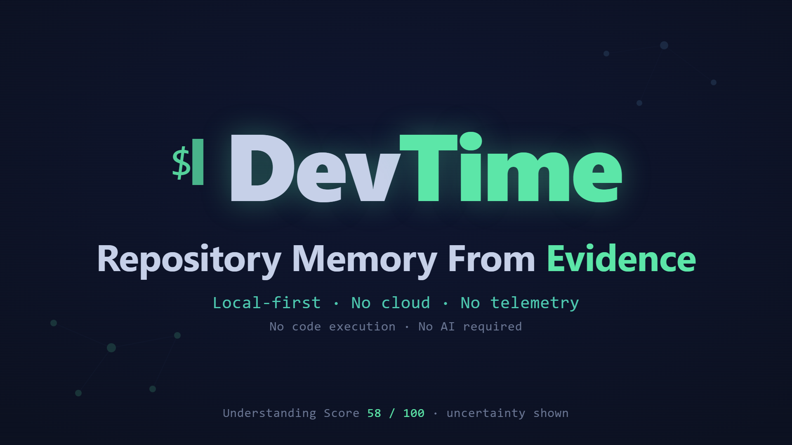

# DevTime

**Local-first Engineering Intelligence for software repositories.**

DevTime helps a codebase explain itself from evidence.

It scans code, tests, configs, routes, and decisions to identify supported software
concepts, link claims to files, surface uncertainty, and warn about a narrow set of
risky changes.

> No cloud. No telemetry. No code execution. No AI required.

[](https://youtu.be/1Hiu3Y9J_SI)

Watch the 2-minute demo: DevTime scans a repo locally, explains concepts from
evidence, surfaces uncertainty, catches a risky diff, and shows how a corroborated
decision improves understanding.

---

## Try DevTime in 60 seconds

```bash
git clone https://github.com/Shakargy/devtime.git
cd devtime
python -m venv .venv
source .venv/bin/activate
pip install -e ".[dev]"
cd examples/demo-saas
dtc init
dtc scan
dtc concepts
dtc explain "Billing Webhooks"
```

On Windows PowerShell:

```powershell
git clone https://github.com/Shakargy/devtime.git
cd devtime
python -m venv .venv
.venv\Scripts\Activate.ps1
pip install -e ".[dev]"
cd examples/demo-saas
dtc init
dtc scan
dtc concepts
dtc explain "Billing Webhooks"
```

You should see Billing Webhooks explained from evidence, including supported claims,
file references, uncertainty, Understanding Score, and Understanding Debt.

To test risk review, make a local change first, then run:

```bash
dtc risk --diff
```

A full, copy-pasteable walkthrough (including the risk-diff and corroborated-decision
steps) is in **[DEMO_SCRIPT.md](DEMO_SCRIPT.md)**.

## Why this exists

Git records what changed, but it does not preserve the reasoning behind those
changes. When you return to a repository - or review one you did not write - you often
have to reconstruct why a behavior exists, what evidence supports it, and what is
still uncertain.

DevTime builds evidence-backed repository memory: a local layer that helps a
codebase explain itself from code, tests, configs, routes, and recorded decisions.
It shows what the repository can support with evidence - and, just as importantly,
what it cannot support yet.

## Who it is for

DevTime is for people who need to understand a repository from evidence rather than
memory.

It is especially useful if you:

- are onboarding to an unfamiliar codebase and need to understand how a feature is implemented;
- are reviewing a pull request and want to see what evidence supports a behavior;
- are returning to a project after weeks or months and cannot remember why something exists;
- maintain a long-lived project where design decisions are easily lost;
- want repository understanding to be backed by code and recorded decisions instead of generated summaries.

Questions DevTime helps answer include:

- Where is authentication actually implemented?
- What files prove that Billing Webhooks exist?
- What is still uncertain?
- Did this diff touch a risky concept?
- Is there a decision explaining this behavior?

## What DevTime does

- Detects concepts from routes, tests, configs, dependencies, and docs.
- Explains from evidence by linking claims to files and signals.
- Surfaces uncertainty when evidence is missing or weak.
- Scores understanding with an Understanding Score and Understanding Debt label.
- Reviews narrow risky diffs with advisory findings from local memory.
- Records decisions locally so rationale can reduce uncertainty when corroborated by code.

## Supported concepts

V0 detects six supported concept families. It does not discover arbitrary domain
concepts yet:

- Authentication
- Billing Webhooks
- Background Jobs
- Data Export
- Admin Permissions
- File Uploads

Anything outside these six is out of scope for V0. See [LIMITATIONS.md](LIMITATIONS.md).

## What DevTime does not do

- It does not execute your code.
- It does not send code or data over the network.
- It does not require or call an AI model.
- It does not guarantee correctness or safe changes.
- It does not replace code review or architecture decisions.
- It is **not** a documentation generator, a static analyzer, an observability tool,
  a productivity tracker, or an AI coding agent.

## Trust model

- DevTime stores local repository memory in `.devtime/` (a local SQLite database).
- **No network access** during a scan.
- **No code execution** during a scan.
- Ignored directories are pruned *before* scanning; ignored files and secrets must
  never become evidence or claims.
- Every claim must link to evidence - *no claim without evidence*.
- Weak evidence produces **uncertainty**, not confidence.
- *Usage is not decision*: that a dependency is used does not mean someone decided why.
- Risk review is **advisory** by default - it does not block PRs.

## Commands

| Command | Purpose |
|---------|---------|
| `dtc init` | Create local `.devtime` memory. |
| `dtc scan` | Scan the current repository and extract evidence-backed signals. |
| `dtc concepts` | List detected concepts with confidence and Understanding Debt. |
| `dtc explain <concept>` | Explain a concept: claims, evidence, confidence, uncertainty, Understanding Debt. |
| `dtc context <concept>` | Create a governed Context Pack for agents or humans. |
| `dtc risk --diff` | Review a git diff for risky changes using local evidence (advisory). |
| `dtc decision add` | Add a local decision record that can reduce uncertainty. |

(Also available: `dtc evidence`, `dtc debt`, `dtc status`, `dtc doctor --privacy`,
`dtc export`, `dtc reset`.)

Requires **Python >= 3.11** and git. See **[QUICKSTART.md](QUICKSTART.md)** for a
step-by-step first run and troubleshooting.

## Installation

Recommended source install for now:

```bash
git clone https://github.com/Shakargy/devtime.git
cd devtime
python -m venv .venv
source .venv/bin/activate
pip install -e ".[dev]"
```

Windows PowerShell:

```powershell
git clone https://github.com/Shakargy/devtime.git
cd devtime
python -m venv .venv
.venv\Scripts\Activate.ps1
pip install -e ".[dev]"
```

Or install from PyPI (the command stays `dtc`):

```bash
pipx install devtime-ei
```

```bash
pip install devtime-ei
```

The PyPI package is named `devtime-ei`; the command it installs is `dtc`.

## Example output

```
$ dtc explain "Billing Webhooks"
Concept: Billing Webhooks

Supported claims:
  - Billing Webhooks is present and supported by behavior evidence.
    type: concept  confidence: 0.86  evidence: src/billing/stripe-webhook.ts, tests/stripe-signature.test.ts
  - Billing Webhooks has active route handling.
    type: behavior  confidence: 0.82  evidence: src/billing/stripe-webhook.ts
  - Billing Webhooks verifies webhook signatures.
    type: behavior  confidence: 0.85  evidence: src/billing/stripe-webhook.ts

Uncertainty:
  - No decision was found explaining key choices for Billing Webhooks.

Understanding Score: 58 / 100
Understanding Debt: medium
causes:
  - missing or uncorroborated decision evidence
  - no confirmed owner
```

> Understanding Score is higher = better understanding; Understanding Debt is a
> label (low/medium/high), not the same number.

## Proof

DevTime runs on `examples/demo-saas` and on real repositories. During Reality
Validation it detected - and then learned from - real failures (Next.js App Router
blindness, a false Billing Webhooks detection on a generic webhook system, a DB
migration mis-counted as Background Jobs evidence, and more). Each failure became a
fixture so it cannot silently regress.

- Tests grew from 13 to 88 as real failures became fixtures.
- Scan time on a 355-file real repo dropped from ~27.3s to ~0.48s after ignored-
  directory pruning.

Full evidence, before/after examples, and the validation reports are in
**[PROOF.md](PROOF.md)** and `reports/reality-validation/`.

## Privacy and safety

- Runs entirely locally; nothing leaves your machine during a scan.
- No code execution and no network calls during scanning.
- Secrets and ignored files are excluded from evidence by design (`dtc doctor
  --privacy` reports the boundaries).
- `dtc reset` deletes local memory; your source code is never modified.

## Known limitations

DevTime is a **heuristic scanner**, not a full compiler or semantic analyzer. It is
currently strongest on TypeScript / Next.js / Express / FastAPI-style repositories
that resemble its fixtures. False positives and false negatives are possible.
Understanding Debt is a product signal, not an objective universal truth.

Read the full list - including framework coverage, risk-review scope, and what is
intentionally not built yet - in **[LIMITATIONS.md](LIMITATIONS.md)**.

## Roadmap

This is an early, local-first V0 focused on being trustworthy before being large.
Not yet built (intentionally): git-history signals, wired MCP transport, an AI
provider, a UI, and any cloud/team/enterprise features. See **[ROADMAP.md](ROADMAP.md)**.

## Contributing

The most valuable contribution is a **fixture**: a small repository pattern plus the
expected concepts, allowed claims, forbidden claims, and required uncertainty. If
DevTime gets something wrong on your code, that wrong output can become a fixture so
it never regresses. See **[CONTRIBUTING.md](CONTRIBUTING.md)**.

## License

Licensed under the **Apache License 2.0**. See [LICENSE](LICENSE).
